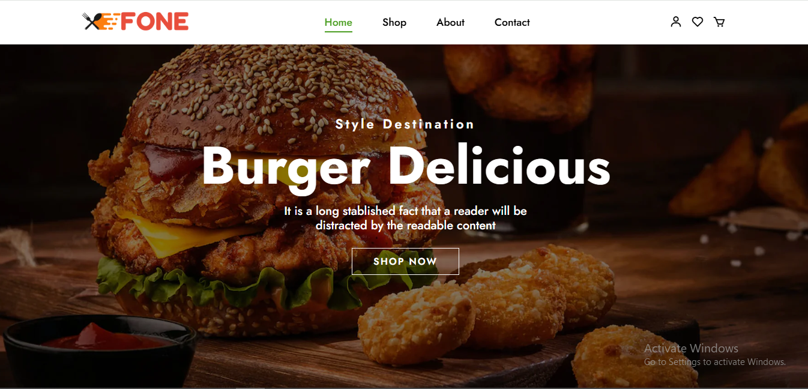
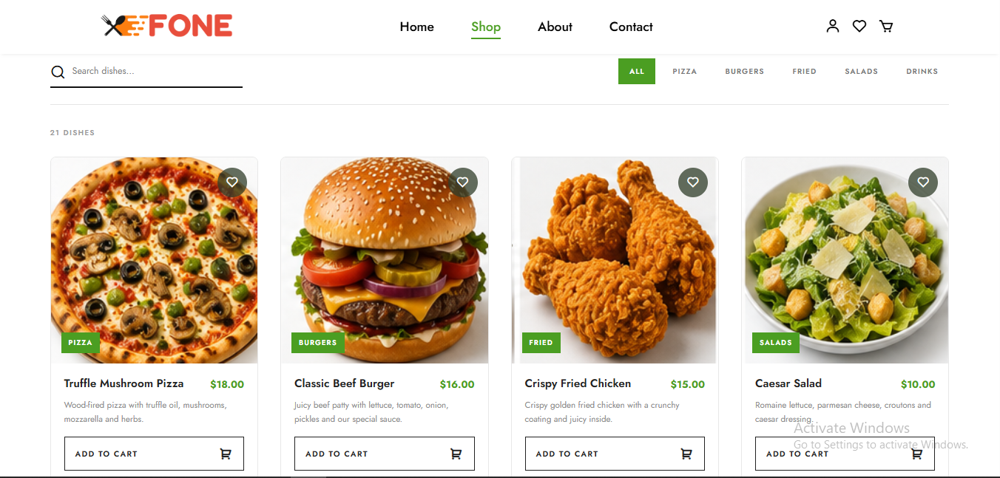
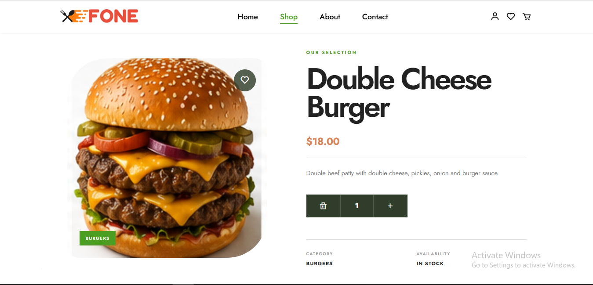
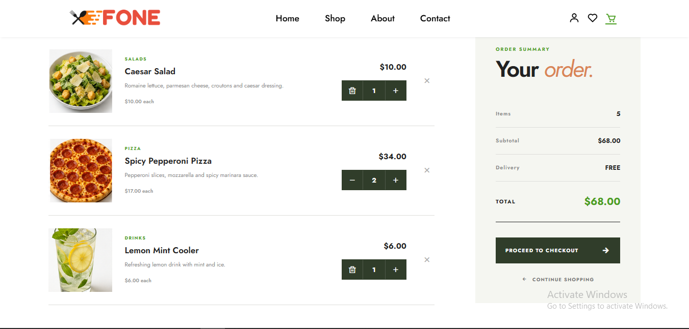
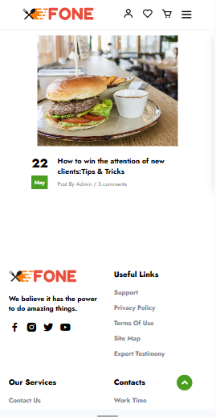

# 🍽️ Restaurant React

A modern, responsive restaurant web application built with **React** and **Vite**, designed to provide a clean and engaging food browsing and ordering experience.

The application includes dynamic food browsing, product details, shopping cart and wishlist functionality, user pages, form validation, responsive layouts, client-side routing, and automated deployment to GitHub Pages.

## 🚀 Live Demo

**[View the live website](https://reza7mohammadi.github.io/restaurant-react-vite/)**

## ✨ Features

- 📱 Fully responsive design for desktop, tablet, and mobile
- 🍔 Dynamic food browsing
- 🛒 Shopping cart with quantity management
- ❤️ Wishlist functionality
- 🔎 Food item detail pages
- 👤 User and registration pages
- 📖 About page
- 📩 Contact page
- 🧭 Client-side routing with React Router
- 🧩 Reusable and component-based architecture
- 📝 Form validation with React Hook Form and Yup
- ⚡ Fast development and production builds with Vite
- 🚀 Automated GitHub Pages deployment with GitHub Actions

## 🖼️ Screenshots

### Home



### Shop



### Food Details



### Cart



### Mobile Responsive



## 🛠️ Tech Stack

| Technology                | Purpose                        |
| ------------------------- | ------------------------------ |
| **React**                 | UI development                 |
| **Vite**                  | Development and build tooling  |
| **React Router**          | Client-side routing            |
| **React Hook Form**       | Form handling                  |
| **Yup**                   | Form validation                |
| **Axios**                 | HTTP requests                  |
| **JavaScript (ES6+)**     | Application logic              |
| **CSS3**                  | Styling and responsive layouts |
| **Boxicons / Remix Icon** | Icons                          |
| **GitHub Actions**        | CI/CD and deployment           |
| **GitHub Pages**          | Production hosting             |

## 📂 Project Structure

```text
src/
├── assest/
├── component/
│   ├── Blog/
│   ├── Cta/
│   ├── Footer/
│   ├── Hero/
│   ├── Navbar/
│   ├── Seller/
│   ├── Store/
│   └── Storebanner/
│
├── Data/
├── Pages/
│   ├── About/
│   ├── Cart/
│   ├── Contact/
│   ├── Fooditem/
│   ├── Home/
│   ├── Shop/
│   ├── User/
│   └── Wishlist/
│
├── validation/
├── App.jsx
├── App.css
├── index.css
└── main.jsx
```

## ⚙️ Getting Started

### Prerequisites

Make sure you have **Node.js** and **npm** installed on your machine.

### Installation

Clone the repository:

```bash
git clone https://github.com/Reza7Mohammadi/restaurant-react-vite.git
```

Navigate to the project directory:

```bash
cd restaurant-react-vite
```

Install dependencies:

```bash
npm install
```

Start the development server:

```bash
npm run dev
```

The application will be available at the local development URL provided by Vite.

## 🏗️ Production Build

Create an optimized production build with:

```bash
npm run build
```

The generated production files will be available in the `dist/` directory.

## 🚀 Deployment

The project is deployed to **GitHub Pages** using **GitHub Actions**.

Every push to the `main` branch triggers the deployment workflow:

```text
Push to main
     ↓
GitHub Actions
     ↓
Install dependencies
     ↓
Build with Vite
     ↓
Upload production artifact
     ↓
Deploy to GitHub Pages
```

This setup provides an automated CI/CD workflow for the production application.

## 🎯 Project Goals

This project was built to practice and demonstrate:

- Component-based React architecture
- State management with React hooks
- Client-side routing
- Reusable UI components
- Form handling and validation
- Responsive web design
- Vite-based development workflows
- Git and GitHub branching workflows
- Pull Requests and code integration
- CI/CD with GitHub Actions
- Production deployment with GitHub Pages

## 📌 Version

Current release: **v1.0.0**

## 👨‍💻 Author

**Reza Mohammadi**

[GitHub](https://github.com/Reza7Mohammadi)

---

⭐ If you found this project interesting, feel free to explore the repository and follow its development.
